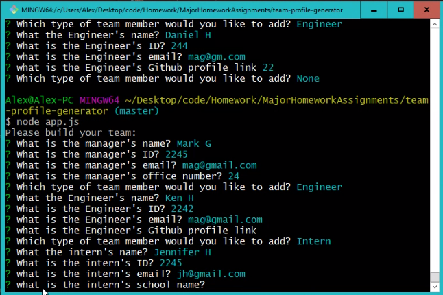
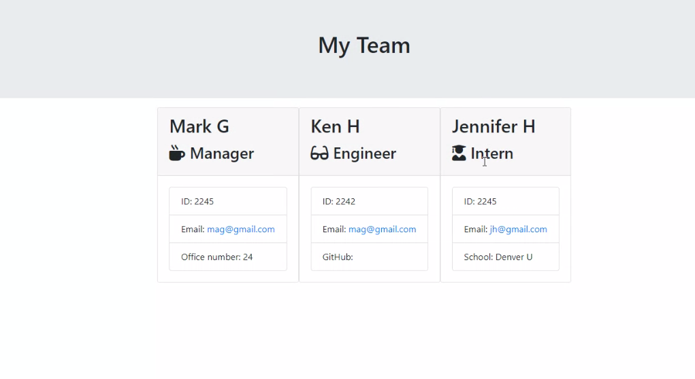

<h2>Team Profile Generator</h2> 
 
[https://github.com/magire01/team-profile-generator](https://github.com/magire01/team-profile-generator/)
 
 

 

 

This website uses node and HTML to allow a user to create a team profile with a manager, and as many engineers and interns as they need. It is powered with node, javascript, and HTML.

 <h5>Table of Contents:</h5>
  <li> Instaillation Details </li>
  <li> Usage </li>
  <li> Contribute </li>
  <li> Testing </li>
  <li> Author </li>
 
 Installation Details: 
 This is a Node app that uses NPM inquirer and FS. It also uses Jest for testing purposes. Run install i. Enter node app.js to launch app. When prompted to add another team member, select "none" to stop the app.

 Usage:
 When the app is ran, the user will be ask to answer a few questions about the Manager. Once the manager is entered, the user will be prompted if they want to add an engineer, intern, or "none". The user can enter as many members as they want and when the user selects "none" the app will stop. Once the app stops, an HTML file will be written to display the team information.

 Contribute:
 Please feel free to make suggestions and changes to this app to make it more user friendly!

 Testing:
 Please run "npm run test" to run testing. This code passed all of the tests in this repo.

Author: Mark Gire

  